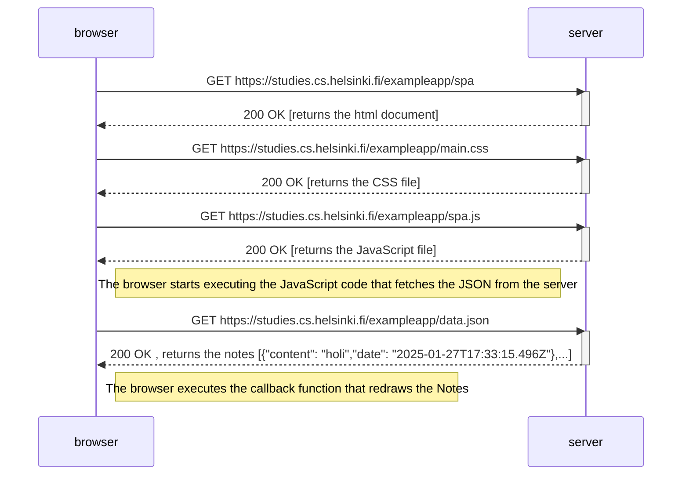

```mermaid
sequenceDiagram
    participant browser
    participant server

    browser->>server: GET https://studies.cs.helsinki.fi/exampleapp/spa
    activate server
    server-->>browser: 200 OK [returns the html document]
    deactivate server

    browser->>server: GET  https://studies.cs.helsinki.fi/exampleapp/main.css
    activate server
    server-->>browser: 200 OK [returns the CSS file]
    deactivate server

    browser->>server: GET   https://studies.cs.helsinki.fi/exampleapp/spa.js
    activate server
    server-->>browser: 200 OK [returns the JavaScript file]
    deactivate server

	Note right of browser: The browser starts executing the JavaScript code that fetches the JSON from the server

    browser->>server: GET https://studies.cs.helsinki.fi/exampleapp/data.json
    activate server
    server-->>browser: 200 OK , returns the notes [{"content": "holi","date": "2025-01-27T17:33:15.496Z"},...]
    deactivate server

    Note right of browser: The browser executes the callback function that redraws the Notes
```