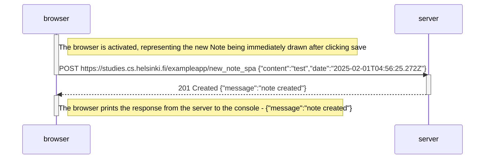

```mermaid
sequenceDiagram
    participant browser
    participant server

	activate browser
	Note right of browser: The browser is activated, representing the new Note being immediately drawn after clicking save
	
	

    browser->>server: POST  https://studies.cs.helsinki.fi/exampleapp/new_note_spa {"content":"test","date":"2025-02-01T04:56:25.272Z"}

	deactivate browser 

    activate server
    server-->>browser: 201 Created {"message":"note created"}
    deactivate server


	activate browser

    Note right of browser: The browser prints the response from the server to the console -  {"message":"note created"}

deactivate browser
```